# Diagramas de Arquitectura - Documentación Completa

## Resumen
Esta sección presenta los diagramas de arquitectura de Croody usando **Mermaid**, un lenguaje de diagramación basado en texto. Los diagramas cubren la arquitectura completa del sistema, desde la vista de alto nivel hasta flujos específicos de usuario, infraestructura, y procesos de desarrollo.

## Ubicación
- **Diagramas**: `/proyecto_integrado/docs/14-DIAGRAMAS/`
- **Archivo principal**: `arquitectura.md` (este documento)

## Tabla de Contenidos
1. [Vista General del Sistema](#1-vista-general-del-sistema)
2. [Arquitectura Django (MVT)](#2-arquitectura-django-mvt)
3. [Microservicios FastAPI](#3-microservicios-fastapi)
4. [Modelo de Base de Datos](#4-modelo-de-base-de-datos)
5. [Arquitectura Docker](#5-arquitectura-docker)
6. [Flujo CI/CD](#6-flujo-cicd)
7. [Arquitectura Frontend](#7-arquitectura-frontend)
8. [Flujo de Internacionalización](#8-flujo-de-internacionalizacion)
9. [Flujo de Usuario](#9-flujo-de-usuario)
10. [Arquitectura de Monitoreo](#10-arquitectura-de-monitoreo)
11. [Infraestructura AWS](#11-infraestructura-aws)
12. [Seguridad y Hardening](#12-seguridad-y-hardening)

---

## 1. Vista General del Sistema

```mermaid
graph TB
    %% Capas del Sistema
    subgraph "Presentación"
        WEB[🌐 Navegadores Web]
        MOBILE[📱 Mobile Apps]
    end

    subgraph "Gateway / CDN"
        CDN[☁️ Cloudflare CDN]
        LB[⚖️ Load Balancer]
    end

    subgraph "Aplicación Web"
        subgraph "Django Application"
            LANDING[🏠 Landing Page]
            BUDDY[🤖 Buddy Feature]
            SHOP[🛒 Shop]
            PROFILE[👤 User Profile]
        end
    end

    subgraph "Microservicios"
        TELEMETRY[📡 Telemetry Gateway<br/>FastAPI :9000]
        IDS[🔒 IDS ML Service<br/>FastAPI :9100]
    end

    subgraph "Almacenamiento"
        DB[(🗄️ PostgreSQL<br/>Primary)]
        REDIS[(⚡ Redis<br/>Cache/Sessions)]
        S3[☁️ S3 Storage<br/>Static Files]
    end

    subgraph "Análisis y Monitoreo"
        PROMETHEUS[📊 Prometheus]
        GRAFANA[📈 Grafana]
        LOGS[📝 Centralized Logs]
    end

    %% Flujo de datos
    WEB --> CDN
    MOBILE --> CDN
    CDN --> LB
    LB --> LANDING
    LB --> BUDDY
    LB --> SHOP
    LB --> PROFILE

    LANDING -.-> TELEMETRY
    BUDDY -.-> TELEMETRY
    SHOP -.-> TELEMETRY

    TELEMETRY --> IDS
    IDS -.-> TELEMETRY

    LANDING --> DB
    BUDDY --> DB
    SHOP --> DB
    PROFILE --> DB

    LANDING --> REDIS
    BUDDY --> REDIS
    SHOP --> REDIS
    PROFILE --> REDIS

    TELEMETRY --> S3

    %% Monitoreo
    LANDING -.-> PROMETHEUS
    BUDDY -.-> PROMETHEUS
    SHOP -.-> PROMETHEUS
    PROFILE -.-> PROMETHEUS

    TELEMETRY -.-> PROMETHEUS
    IDS -.-> PROMETHEUS

    PROMETHEUS --> GRAFANA
    LANDING -.-> LOGS
    TELEMETRY -.-> LOGS
    IDS -.-> LOGS

    %% Estilos
    classDef django fill:#0b4,stroke:#083,stroke-width:2px,color:#fff
    classDef fastapi fill:#009485,stroke:#006f63,stroke-width:2px,color:#fff
    classDef storage fill:#4682b4,stroke:#36648b,stroke-width:2px,color:#fff
    classDef monitoring fill:#ff6347,stroke:#c9412e,stroke-width:2px,color:#fff

    class LANDING,BUDDY,SHOP,PROFILE django
    class TELEMETRY,IDS fastapi
    class DB,REDIS,S3 storage
    class PROMETHEUS,GRAFANA,LOGS monitoring
```



### Descripción
Este diagrama muestra la **arquitectura de alto nivel** del proyecto Croody, organizada en capas:
- **Presentación**: Interfaces de usuario (web, mobile)
- **Gateway**: CDN y balanceador de carga
- **Aplicación**: Django (4 módulos principales) + FastAPI (2 microservicios)
- **Almacenamiento**: PostgreSQL, Redis, S3
- **Monitoreo**: Prometheus, Grafana, logs centralizados

---

## 2. Arquitectura Django (MVT)

```mermaid
graph LR
    %% MVT Pattern
    subgraph "Model"
        M1[👤 UserProfile<br/>OneToOne → User]
        M2[🛍️ Product<br/>QuerySet personalizado]
        M3[🤖 RobotPosition<br/>ForeignKey → User]
    end

    subgraph "View (CBV)"
        V1[🏠 HomeView<br/>TemplateView + Mixin]
        V2[👤 ProfileView<br/>LoginRequired + TemplateView]
        V3[🛍️ ProductListView<br/>ListView + Filtering]
        V4[🛍️ ProductDetailView<br/>DetailView]
    end

    subgraph "Template"
        T1[🏠 home.html<br/>Hero + Metrics + Ecosystem]
        T2[🤖 buddy.html<br/>Explicación paso a paso]
        T3[🛍️ catalogue.html<br/>Filtros + Búsqueda]
        T4[🛍️ detail.html<br/>Producto + CTA]
        T5[👤 profile.html<br/>Forms + Token]
        TBASE[🎨 base.html<br/>Layout + Nav + Footer]
    end

    %% Relaciones MVT
    V1 --> T1
    V1 -.-> TBASE
    V2 --> T5
    V2 -.-> TBASE
    V3 --> T3
    V3 -.-> TBASE
    V4 --> T4
    V4 -.-> TBASE

    T1 -.-> M2
    T3 -.-> M2
    T4 -.-> M2
    T5 -.-> M1
    T5 -.-> M2

    %% Signals (Automation)
    subgraph "Signals"
        SIG1[post_save User<br/>→ Create UserProfile]
        SIG2[post_save User<br/>→ Save UserProfile]
    end

    M1 -.-> SIG1
    M1 -.-> SIG2

    %% Forms
    subgraph "Forms"
        F1[📝 CroodySignupForm<br/>UserCreationForm + Fields]
        F2[📝 CroodyLoginForm<br/>Auth + Email → Username]
        F3[📝 ProfileForm<br/>ModelForm User]
        F4[📝 ProfilePreferencesForm<br/>ModelForm UserProfile]
    end

    V2 -.-> F3
    V2 -.-> F4
    V2 -.-> F1

    %% Estilos
    classDef model fill:#4169e1,stroke:#2e4a8a,stroke-width:2px,color:#fff
    classDef view fill:#0b4,stroke:#083,stroke-width:2px,color:#fff
    classDef template fill:#ff8c00,stroke:#c46a06,stroke-width:2px,color:#fff
    classDef form fill:#9932cc,stroke:#6d1f8a,stroke-width:2px,color:#fff
    classDef signal fill:#dc143c,stroke:#a01020,stroke-width:2px,color:#fff

    class M1,M2,M3 model
    class V1,V2,V3,V4 view
    class T1,T2,T3,T4,TBASE template
    class F1,F2,F3,F4 form
    class SIG1,SIG2 signal
```



### Descripción
Diagrama del **patrón MVT (Model-View-Template)** de Django mostrando:
- **Models**: UserProfile (OneToOne), Product (QuerySet custom), RobotPosition
- **Views**: Class-Based Views con Mixins (HomeView, ProfileView, ProductListView)
- **Templates**: 5 templates principales + base
- **Forms**: 4 formularios (registro, login, perfil, preferencias)
- **Signals**: Automatización para creación/guardado de perfiles

---

## 3. Microservicios FastAPI

```mermaid
graph TB
    %% Telemetry Gateway
    subgraph "Telemetry Gateway (Port 9000)"
        TG1[📡 Ingest Endpoint<br/>POST /api/telemetry/ingest]
        TG2[📊 Last Telemetry<br/>GET /api/telemetry/last]
        TG3[📈 Live Telemetry<br/>GET /api/telemetry/live]
        TG4[🔍 Query Telemetry<br/>GET /api/telemetry/query]
        TG5[❤️ Health Check<br/>GET /healthz]

        TG_DB[(SQLite<br/>telemetry.db)]
    end

    %% IDS ML Service
    subgraph "IDS ML Service (Port 9100)"
        IDS1[🤖 Predict Endpoint<br/>POST /api/ids/predict]
        IDS2[❤️ Health Check<br/>GET /healthz]

        subgraph "ML Model"
            MODEL_PATH[/models/model.pkl]
            MODEL_METADATA[/models/metadata.json]
        end
    end

    %% External
    subgraph "External Services"
        ROBOT1[🤖 Robot Alpha<br/>Sends telemetry]
        ROBOT2[🤖 Robot Beta<br/>Sends telemetry]
        DB_POSTGRES[(PostgreSQL<br/>Optional)]
    end

    %% Flow
    ROBOT1 -.->|POST Telemetry Data| TG1
    ROBOT2 -.->|POST Telemetry Data| TG1

    TG1 --> TG_DB
    TG1 --> IDS2

    TG2 -.-> TG_DB
    TG3 -.-> TG_DB
    TG4 -.-> TG_DB

    IDS1 -.-> MODEL_PATH
    IDS1 -.-> MODEL_METADATA

    TG2 -.->|Robot ID| IDS1
    TG3 -.->|Robot ID| IDS1

    TG5 -->|Status| MONITORING
    IDS2 -->|Status| MONITORING

    %% Optional PostgreSQL
    TG_DB -.-> DB_POSTGRES

    %% Estilos
    classDef telemetry fill:#009485,stroke:#006f63,stroke-width:2px,color:#fff
    classDef ids fill:#ff6f00,stroke:#c45000,stroke-width:2px,color:#fff
    classDef storage fill:#4682b4,stroke:#36648b,stroke-width:2px,color:#fff
    classDef robot fill:#7b68ee,stroke:#5a4bbf,stroke-width:2px,color:#fff

    class TG1,TG2,TG3,TG4,TG5 telemetry
    class IDS1,IDS2 ids
    class TG_DB,DB_POSTGRES,MODEL_PATH,MODEL_METADATA storage
    class ROBOT1,ROBOT2 robot
```

### Descripción
Arquitectura de **microservicios FastAPI** con dos servicios independientes:
- **Telemetry Gateway**: Receives y almacena datos de telemetría de robots (5 endpoints)
- **IDS ML Service**: Análisis de seguridad usando ML model (1 endpoint predictivo)
- **Almacenamiento**: SQLite por defecto, PostgreSQL opcional
- **Modelo ML**: Archivo pickle + metadata JSON

---

## 4. Modelo de Base de Datos

```mermaid
erDiagram
    %% User & Profile
    User {
        int id PK
        string username UK
        string email UK
        string first_name
        string last_name
        string password
        datetime date_joined
        boolean is_active
    }

    UserProfile {
        int id PK
        int user_id FK
        string display_name
        string preferred_language
        string preferred_theme
        string ingest_token UK
        boolean telemetry_alerts
        datetime created_at
        datetime updated_at
    }

    %% Shop
    Product {
        int id PK
        string name
        string slug UK
        string teaser
        text description
        decimal price
        string delivery_estimate
        string badge_label
        boolean is_published
        int sort_order
        datetime created_at
        datetime updated_at
    }

    %% Telemetry
    TelemetryData {
        int id PK
        string robot_id
        json data
        json position
        string environment
        string status
        datetime timestamp
    }

    %% Relations
    User ||--|| UserProfile : "OneToOne"
    UserProfile ||--o{ TelemetryData : "ingest_token"
    User ||--o{ TelemetryData : "robot_id (optional)"

    %% QuerySet personalizado
    ProductQuerySet {
        +published()
        +search(query)
    }
```

### Descripción
**Diagrama ER** de la base de datos con:
- **User & Profile**: Relación OneToOne con token de ingestión
- **Product**: Con QuerySet personalizado (published, search)
- **TelemetryData**: Datos de robots en formato JSON
- **Relaciones**: Claramente definidas con claves primarias/foráneas

---

## 5. Arquitectura Docker

```mermaid
graph TB
    %% Network
    subgraph "Docker Network: croody-network"
        %% Services
        subgraph "Services"
            NGINX[🌐 Nginx Gateway<br/>Port: 80, 443]
            WEB[🐍 Django Web<br/>Port: 8000]
            TELEMETRY[📡 Telemetry Gateway<br/>Port: 9000]
            IDS[🔒 IDS ML Service<br/>Port: 9100]
            ROBOT_SIM[🤖 Robot Simulator<br/>Port: 9200]
        end

        %% Volumes
        subgraph "Volumes"
            VOL1[📦 postgres_data]
            VOL2[📦 redis_data]
            VOL3[📦 static_volume]
            VOL4[📦 telemetry_db]
        end

        %% Health Checks
        NGINX -.->|Health Check| WEB
        WEB -.->|Health Check| TELEMETRY
        WEB -.->|Health Check| IDS
        TELEMETRY -.->|Health Check| ROBOT_SIM
    end

    %% External
    DATABASE[(🗄️ PostgreSQL<br/>External/Cloud)]

    %% Connections
    WEB --> DATABASE
    WEB -.-> VOL1
    WEB -.-> VOL2
    WEB -.-> VOL3

    TELEMETRY -.-> VOL4

    %% Docker Compose Config
    docker-compose.yml[
        📄 docker-compose.yml
        - 5 Services
        - 4 Volumes
        - 3 Networks
        - Health checks
    ]

    %% Estilos
    classDef service fill:#099,stroke:#077,stroke-width:2px,color:#fff
    classDef volume fill:#9370db,stroke:#6d4fa8,stroke-width:2px,color:#fff
    classDef config fill:#ff8c00,stroke:#c46a06,stroke-width:2px,color:#fff
    classDef external fill:#4682b4,stroke:#36648b,stroke-width:2px,color:#fff

    class NGINX,WEB,TELEMETRY,IDS,ROBOT_SIM service
    class VOL1,VOL2,VOL3,VOL4 volume
    class docker-compose.yml config
    class DATABASE external
```



### Descripción
Arquitectura **Docker Compose** con:
- **5 Services**: Nginx, Django, Telemetry Gateway, IDS ML, Robot Simulator
- **4 Volumes**: PostgreSQL, Redis, Static files, Telemetry DB
- **Health Checks**: Automáticos para cada servicio
- **Redes**: Network interno para comunicación entre servicios

---

## 6. Flujo CI/CD

```mermaid
graph LR
    %% Source Control
    subgraph "Source Control"
        REPO[📦 Git Repository<br/>GitHub]
        BRANCH[🌿 Feature Branch<br/>or PR]
    end

    %% CI Pipeline
    subgraph "GitHub Actions CI"
        TRIGGER[🚀 Trigger<br/>Push/PR]
        CHECKOUT[📥 Checkout Code]
        SETUP_PY[🐍 Setup Python 3.11]
        INSTALL[📦 Install Dependencies]
        MIGRATE[🗄️ Run Migrations]
        TEST[🧪 Run Tests<br/>Unit + Integration]
        E2E[✅ E2E Tests<br/>Playwright]
        COVERAGE[📊 Coverage Report]
        BUILD[🏗️ Build Docker Image]
        PUSH[📤 Push Image<br/>to Registry]
    end

    %% Approval
    APPROVAL[👤 Manual Approval<br/>Production Deploy]

    %% CD Pipeline
    subgraph "CD - Production"
        DEPLOY[🚀 Deploy<br/>to AWS]
        HEALTH[❤️ Health Check]
        VERIFY[✅ Verify Deployment]
    end

    %% Monitoring
    subgraph "Monitoring"
        SLACK[📢 Slack Notification]
        GITHUB[📝 GitHub Status]
    end

    %% Flow
    BRANCH --> TRIGGER
    TRIGGER --> CHECKOUT
    CHECKOUT --> SETUP_PY
    SETUP_PY --> INSTALL
    INSTALL --> MIGRATE
    MIGRATE --> TEST
    TEST --> E2E
    E2E --> COVERAGE
    COVERAGE --> BUILD
    BUILD --> PUSH
    PUSH --> APPROVAL

    APPROVAL --> DEPLOY
    DEPLOY --> HEALTH
    HEALTH --> VERIFY

    VERIFY --> SLACK
    VERIFY --> GITHUB

    %% Estilos
    classDef source fill:#6e4c93,stroke:#4a2e6b,stroke-width:2px,color:#fff
    classDef ci fill:#0b4,stroke:#083,stroke-width:2px,color:#fff
    classDef cd fill:#ff6347,stroke:#c9412e,stroke-width:2px,color:#fff
    classDef monitor fill:#4682b4,stroke:#36648b,stroke-width:2px,color:#fff

    class REPO,BRANCH source
    class CHECKOUT,SETUP_PY,INSTALL,MIGRATE,TEST,E2E,COVERAGE,BUILD,PUSH ci
    class APPROVAL,DEPLOY,HEALTH,VERIFY cd
    class SLACK,GITHUB monitor
```



### Descripción
**Pipeline CI/CD** completo con:
- **CI (Continuous Integration)**: 10 steps desde checkout hasta push
- **Testing**: Unit, Integration, E2E con Playwright
- **Approval**: Manual approval para producción
- **CD (Continuous Deployment)**: Deploy a AWS con health checks
- **Monitoring**: Slack y GitHub notifications

---

## 7. Arquitectura Frontend

```mermaid
graph TB
    %% Design System
    subgraph "Design System"
        TOKENS[🎨 Design Tokens<br/>Colors, Spacing, Typography]
        COMPONENTS[🧩 Components<br/>Buttons, Cards, Forms]
        PATTERNS[📐 Patterns<br/>Layout, Grid, Navigation]
    end

    %% Templates
    subgraph "Templates (Django)"
        BASE[🎨 base.html<br/>Layout + Navigation]
        LANDING[🏠 home.html<br/>Hero + Metrics + Ecosystem]
        BUDDY[🤖 buddy.html<br/>Step-by-step]
        SHOP_LIST[🛒 catalogue.html<br/>Product List + Filters]
        SHOP_DETAIL[🛒 detail.html<br/>Product Detail]
        PROFILE[👤 profile.html<br/>Forms + Token]
    end

    %% JavaScript
    subgraph "JavaScript Modules"
        THEME[🌓 Theme Toggle<br/>Dark/Light]
        LANG[🌍 Language Selector<br/>8 Languages]
        SEARCH[🔍 Search Module<br/>Filters + Results]
        MOBILE[📱 Mobile Menu<br/>Responsive Nav]
    end

    %% CSS
    subgraph "CSS Architecture"
        BASE_CSS[📄 base.css<br/>Reset + Typography]
        COMPONENTS_CSS[📄 components.css<br/>UI Components]
        TOKENS_CSS[📄 tokens.css<br/>CSS Variables]
        ANIMATIONS[✨ animations.css<br/>Transitions]
    end

    %% Static Files
    subgraph "Static Assets"
        IMAGES[🖼️ Images<br/>SVG, PNG, WebP]
        FONTS[🔤 Fonts<br/>Web Fonts]
        ICONS[📦 Icons<br/>SVG Icons]
    end

    %% Data Flow
    THEME --> BASE_CSS
    LANG --> BASE
    SEARCH --> SHOP_LIST
    MOBILE --> BASE

    COMPONENTS --> COMPONENTS_CSS
    TOKENS --> TOKENS_CSS

    BASE_CSS --> BASE
    COMPONENTS_CSS --> LANDING
    COMPONENTS_CSS --> BUDDY
    COMPONENTS_CSS --> SHOP_LIST
    COMPONENTS_CSS --> SHOP_DETAIL
    COMPONENTS_CSS --> PROFILE

    IMAGES --> LANDING
    IMAGES --> BUDDY
    FONTS --> BASE
    ICONS --> BASE

    %% Estilos
    classDef design fill:#ff8c00,stroke:#c46a06,stroke-width:2px,color:#fff
    classDef template fill:#6e4c93,stroke:#4a2e6b,stroke-width:2px,color:#fff
    classDef js fill:#f7df1e,stroke:#c2a700,stroke-width:2px,color:#000
    classDef css fill:#1572b6,stroke:#0e5a8f,stroke-width:2px,color:#fff
    classDef assets fill:#4682b4,stroke:#36648b,stroke-width:2px,color:#fff

    class TOKENS,COMPONENTS,PATTERNS design
    class BASE,LANDING,BUDDY,SHOP_LIST,SHOP_DETAIL,PROFILE template
    class THEME,LANG,SEARCH,MOBILE js
    class BASE_CSS,COMPONENTS_CSS,TOKENS_CSS,ANIMATIONS css
    class IMAGES,FONTS,ICONS assets
```



### Descripción
**Arquitectura Frontend** con:
- **Design System**: Tokens, Components, Patterns basados en Golden Ratio
- **Templates**: 6 templates Django reutilizables
- **JavaScript**: 4 módulos (theme, language, search, mobile)
- **CSS**: 4 archivos organizados (base, components, tokens, animations)
- **Assets**: Images, fonts, icons organizados

---

## 8. Flujo de Internacionalización

```mermaid
flowchart LR
    %% User Request
    USER[👤 User Request<br/>Detects language preference]

    %% Django i18n
    subgraph "Django i18n System"
        LOCALE_MIDDLEWARE[🌍 LocaleMiddleware<br/>Detects language]
        LANG_DETECTOR[🔍 Language Detector<br/>Cookie → Header → Default]
        ROUTER[🛣️ URL Router<br/>Adds language prefix]
    end

    %% Template Rendering
    subgraph "Template Rendering"
        TRANS_TAG[<br/>Mark strings as translatable]
        BLOCKTRANS[<br/>Complex translations]
        NGETTEXT[ngettext<br/>Pluralization]
    end

    %% Message Files
    subgraph "Message Files (.po)"
        ES_PO[🇪🇸 es/LC_MESSAGES/django.po]
        EN_PO[🇺🇸 en/LC_MESSAGES/django.po]
        FR_PO[🇫🇷 fr/LC_MESSAGES/django.po]
        PT_PO[🇵🇹 pt/LC_MESSAGES/django.po]
        AR_PO[🇸🇦 ar/LC_MESSAGES/django.po]
        ZH_PO[🇨🇳 zh_Hans/LC_MESSAGES/django.po]
        JA_PO[🇯🇵 ja/LC_MESSAGES/django.po]
        HI_PO[🇮🇳 hi/LC_MESSAGES/django.po]
    end

    %% Compilation
    subgraph "Compilation"
        COMPILE[🔨 compilemessages<br/>Compiles .po → .mo]
        ES_MO[🇪🇸 es/LC_MESSAGES/django.mo]
        EN_MO[🇺🇸 en/LC_MESSAGES/django.mo]
    end

    %% Language Selection
    subgraph "Language Selection"
        COOKIE[🍪 Language Cookie<br/>Stores user preference]
        SESSION[📦 Session Storage<br/>Temporary language]
        DEFAULT[⭐ Default Language<br/>es (Spanish)]
    end

    %% Process Flow
    USER --> LOCALE_MIDDLEWARE
    LOCALE_MIDDLEWARE --> LANG_DETECTOR
    LANG_DETECTOR --> ROUTER

    ROUTER --> TRANS_TAG
    TRANS_TAG --> ES_PO
    EN_PO --> COMPILE
    FR_PO --> COMPILE
    PT_PO --> COMPILE
    AR_PO --> COMPILE
    ZH_PO --> COMPILE
    JA_PO --> COMPILE
    HI_PO --> COMPILE

    COMPILE --> ES_MO
    COMPILE --> EN_MO

    LANG_DETECTOR --> COOKIE
    LANG_DETECTOR --> SESSION
    LANG_DETECTOR --> DEFAULT

    %% Estilos
    classDef django fill:#0b4,stroke:#083,stroke-width:2px,color:#fff
    classDef message fill:#ff8c00,stroke:#c46a06,stroke-width:2px,color:#fff
    classDef compile fill:#009485,stroke:#006f63,stroke-width:2px,color:#fff
    classDef storage fill:#9370db,stroke:#6d4fa8,stroke-width:2px,color:#fff

    class LOCALE_MIDDLEWARE,LANG_DETECTOR,ROUTER,TRANS_TAG,BLOCKTRANS,NGETTEXT django
    class ES_PO,EN_PO,FR_PO,PT_PO,AR_PO,ZH_PO,JA_PO,HI_PO message
    class COMPILE,ES_MO,EN_MO compile
    class COOKIE,SESSION,DEFAULT storage
```

### Descripción
**Sistema de internacionalización** con:
- **8 idiomas**: ES, EN, FR, PT, AR (RTL), ZH-Hans, JA, HI
- **LocaleMiddleware**: Detecta idioma desde cookie/header
- **Message files**: .po para traducción, .mo compilado
- **URL routing**: Prefijos de idioma en URLs
- **Storage**: Cookie, Session, Default

---

## 9. Flujo de Usuario

```mermaid
graph TD
    %% Entry Points
    START[🌐 User Visits<br/>croody.app] --> LANDING[🏠 Landing Page<br/>Hero + Metrics]

    %% Landing Flow
    LANDING --> CTA1[Primary CTA<br/>🛒 Ir a la Tienda]
    LANDING --> CTA2[Secondary CTA<br/>🤖 Ver Buddy]
    LANDING --> CTA3[Tertiary CTA<br/>ℹ️ Conocer Más]

    %% Buddy Flow
    CTA2 --> BUDDY[🤖 Buddy Page<br/>Step-by-step explanation]
    BUDDY --> BUDDY_CTA[📝 CTA<br/>Empezar Ahora]
    BUDDY_CTA --> SHOP_LIST[🛒 Product Catalogue<br/>Browse Products]

    %% Shop Flow
    CTA1 --> SHOP_LIST
    SHOP_LIST --> FILTER[🔍 Filter Products<br/>By category, price]
    SHOP_LIST --> SEARCH[🔎 Search Products<br/>By name, teaser]
    SHOP_LIST --> PRODUCT[📦 Product Detail<br/>View details]
    PRODUCT --> ADD_CART[🛒 Add to Cart<br/>or Continue]

    %% Auth Flow
    ADD_CART --> LOGIN[🔑 Login Required<br/>Redirect to Login]
    LOGIN --> LOGIN_FORM[📝 Login Form<br/>Username/Email + Password]
    LOGIN_FORM --> LOGIN_SUCCESS[✅ Login Success<br/>Redirect to Profile]
    LOGIN_FORM --> LOGIN_ERROR[❌ Login Failed<br/>Show error + Retry]

    LOGIN_SUCCESS --> REGISTER[📝 Register<br/>No account? Sign up]
    REGISTER --> REGISTER_FORM[📝 Sign Up Form<br/>Full name, email, etc.]
    REGISTER_FORM --> REGISTER_SUCCESS[✅ Registration Success<br/>Auto-login + Profile]
    REGISTER_SUCCESS --> PROFILE[👤 User Profile<br/>Welcome screen]

    %% Profile Flow
    LOGIN_SUCCESS --> PROFILE
    BUDDY_CTA -.-> PROFILE

    PROFILE --> PROFILE_TAB1[👤 Info Tab<br/>Personal information]
    PROFILE --> PROFILE_TAB2[⚙️ Preferences Tab<br/>Language + Theme]
    PROFILE --> PROFILE_TAB3[🔑 Token Tab<br/>Ingest token for robots]

    PROFILE_TAB3 --> TOKEN[🔑 View Token<br/>Generate/Copy token]
    TOKEN --> TOKEN_ACTION[🔄 Action<br/>Regenerate token]

    %% End States
    TOKEN_ACTION --> THANK_YOU[🙏 Thank You<br/>Token updated]
    PROFILE_TAB2 --> THEME_SWITCH[🌓 Theme Change<br/>Dark/Light/System]

    %% Mobile Flow
    MOBILE[📱 Mobile User<br/>Mobile Browser] --> MOBILE_LANDING[🏠 Mobile Landing<br/>Responsive design]
    MOBILE_LANDING --> MOBILE_NAV[📱 Mobile Menu<br/>Hamburger menu]
    MOBILE_NAV --> MOBILE_SHOP[🛒 Shop Mobile<br/>Touch optimized]

    %% Estilos
    classDef entry fill:#6e4c93,stroke:#4a2e6b,stroke-width:2px,color:#fff
    classDef action fill:#0b4,stroke:#083,stroke-width:2px,color:#fff
    classDef auth fill:#ff8c00,stroke:#c46a06,stroke-width:2px,color:#fff
    classDef page fill:#009485,stroke:#006f63,stroke-width:2px,color:#fff
    classDef mobile fill:#1572b6,stroke:#0e5a8f,stroke-width:2px,color:#fff
    classDef end fill:#4682b4,stroke:#36648b,stroke-width:2px,color:#fff

    class START,LANDING,BUDDY,SHOP_LIST,PRODUCT,PROFILE entry
    class CTA1,CTA2,CTA3,BUDDY_CTA,FILTER,SEARCH,ADD_CART,TOKEN_ACTION action
    class LOGIN,LOGIN_FORM,LOGIN_SUCCESS,LOGIN_ERROR,REGISTER,REGISTER_FORM,REGISTER_SUCCESS auth
    class LOGIN_SUCCESS,BUDDY_CTA,PROFILE_TAB1,PROFILE_TAB2,PROFILE_TAB3 page
    class MOBILE,MOBILE_LANDING,MOBILE_NAV,MOBILE_SHOP mobile
    class THANK_YOU,THEME_SWITCH end
```

### Descripción
**Flujo completo de usuario** desde landing hasta profile:
- **Landing**: 3 CTAs hacia diferentes secciones
- **Buddy**: Educación sobre feature + CTA a shop
- **Shop**: Filtros, búsqueda, detalle de producto
- **Auth**: Login/Register con validaciones
- **Profile**: 3 tabs (info, preferencias, token)
- **Mobile**: Versión responsive separada

---

## 10. Arquitectura de Monitoreo


### Descripción
**Sistema de monitoreo** multi-capa:
- **Logging**: Structured JSON logs desde Django y FastAPI
- **Metrics**: Prometheus recopila métricas (response time, errors, resources)
- **Health Checks**: Endpoints `/health` y `/healthz`
- **Alerting**: Reglas configurables con notificaciones (Slack, email, webhook)
- **Dashboard**: Grafana y Kibana para visualización unificada

---

## 11. Infraestructura AWS

```mermaid
graph TB
    %% Internet
    subgraph "Internet"
        USERS[👥 Users<br/>Global]
    end

    %% CloudFront
    CDN[☁️ CloudFront CDN<br/>Global edge locations<br/>Caching & DDoS protection]

    %% VPC
    subgraph "AWS VPC (Virtual Private Cloud)"
        %% Public Subnet
        subgraph "Public Subnet 1a"
            ALB[⚖️ Application Load Balancer<br/>HTTP/HTTPS, Health checks]
            NGINX[🐳 Nginx Bastion<br/>Static files, SSL termination]
            BIND[🔧 BIND9 DNS<br/>Internal DNS resolution]
        end

        %% Private Subnet
        subgraph "Private Subnet 1a"
            ECS[🐳 ECS Cluster<br/>Docker containers orchestration]
            subgraph "ECS Tasks"
                DJANGO_TASK[🐍 Django Task<br/>Web application]
                FASTAPI_TASK1[📡 Telemetry Gateway<br/>FastAPI service]
                FASTAPI_TASK2[🔒 IDS ML Service<br/>FastAPI ML inference]
            end
        end

        %% RDS Subnet
        subgraph "RDS Subnet 1a"
            RDS[🗄️ RDS PostgreSQL<br/>Multi-AZ, Automated backups]
        end

        %% ElastiCache
        subgraph "ElastiCache"
            REDIS[⚡ Redis Cluster<br/>Cache & Session storage]
        end

        %% S3
        S3[☁️ S3 Bucket<br/>Static files, Media, Backups]
    end

    %% Security Groups
    subgraph "Security Groups (Firewall)"
        SG_ALB[🌐 ALB SG<br/>Ports 80, 443]
        SG_ECS[🐳 ECS SG<br/>Port 8000, 9000, 9100]
        SG_RDS[🗄️ RDS SG<br/>Port 5432]
        SG_REDIS[⚡ Redis SG<br/>Port 6379]
    end

    %% Monitoring
    subgraph "AWS Monitoring"
        CLOUDWATCH[📊 CloudWatch<br/>Metrics, Logs, Alarms]
        XRAY[🔍 X-Ray<br/>Distributed tracing]
    end

    %% IAM
    subgraph "IAM Roles"
        ECS_ROLE[🐳 ECS Task Role<br/>Access to S3, RDS, CloudWatch]
    end

    %% Connections
    USERS --> CDN
    CDN --> ALB
    ALB --> NGINX
    NGINX --> ECS

    ECS --> RDS
    ECS --> REDIS
    ECS --> S3

    NGINX -.-> BIND

    %% Security Groups
    SG_ALB -.-> ALB
    SG_ECS -.-> ECS
    SG_RDS -.-> RDS
    SG_REDIS -.-> REDIS

    %% Monitoring
    ECS -.-> CLOUDWATCH
    RDS -.-> CLOUDWATCH
    ECS -.-> XRAY

    %% IAM
    ECS -.-> ECS_ROLE
    ECS_ROLE -.-> S3
    ECS_ROLE -.-> CLOUDWATCH

    %% Estilos
    classDef aws fill:#ff9900,stroke:#cc7a00,stroke-width:2px,color:#000
    classDef service fill:#009485,stroke:#006f63,stroke-width:2px,color:#fff
    classDef storage fill:#4682b4,stroke:#36648b,stroke-width:2px,color:#fff
    classDef security fill:#dc143c,stroke:#a01020,stroke-width:2px,color:#fff
    classDef monitor fill:#9932cc,stroke:#6d1f8a,stroke-width:2px,color:#fff

    class CDN,VPC,ECS,RDS,REDIS,S3,CLOUDWATCH,XRAY,ALB,NGINX,BIND aws
    class DJANGO_TASK,FASTAPI_TASK1,FASTAPI_TASK2 service
    class RDS,REDIS,S3 storage
    class SG_ALB,SG_ECS,SG_RDS,SG_REDIS,ECS_ROLE security
    class CLOUDWATCH,XRAY monitor
```



### Descripción
**Infraestructura AWS** con:
- **CloudFront CDN**: Global edge locations para caching
- **VPC**: Virtual Private Cloud con subnets públicas/privadas
- **ECS**: Elastic Container Service para Docker orchestration
- **RDS**: PostgreSQL Multi-AZ con backups automáticos
- **ElastiCache**: Redis cluster para caching
- **S3**: Almacenamiento para static files y backups
- **CloudWatch**: Monitoreo, logs y alarmas
- **IAM**: Roles para acceso seguro entre servicios

---

## 12. Seguridad y Hardening

```mermaid
graph TB
    %% Edge Security
    subgraph "Edge Security"
        CLOUDFLARE[☁️ Cloudflare<br/>DDoS protection, WAF, Bot management]
        CDN_SEC[🔒 HTTPS Enforcement<br/>Automatic SSL/TLS]
    end

    %% Application Security
    subgraph "Application Security (Django)"
        CSRF[🛡️ CSRF Protection<br/>Tokens en todos los forms]
        AUTH[🔑 Authentication<br/>Login, Session management]
        PERM[🔐 Authorization<br/>User permissions]
        XSS[🚫 XSS Prevention<br/>Escaping templates]
        SQL_INJECT[🚫 SQL Injection<br/>ORM protected]
    end

    %% API Security
    subgraph "API Security (FastAPI)"
        CORS[🌍 CORS Config<br/>Restricted origins]
        RATE[⏱️ Rate Limiting<br/>Limit requests/minute]
        API_KEY[🔑 API Keys<br/>Authentication required]
        VALIDATION[✅ Input Validation<br/>Pydantic models]
    end

    %% Network Security
    subgraph "Network Security"
        FIREWALL[🔥 UFW Firewall<br/>iptables rules]
        PORTS[🚪 Port Config<br/>Only necessary ports open]
        VPC[🌐 VPC Isolation<br/>Private subnets]
        SG[🔒 Security Groups<br/>AWS firewall rules]
    end

    %% Data Security
    subgraph "Data Security"
        ENCRYPTION[🔐 Data Encryption<br/>At rest and in transit]
        HASHING[🔒 Password Hashing<br/>bcrypt/Argon2]
        SECRETS[🤐 Secrets Management<br/>Environment variables]
        BACKUP_ENCRYPT[🔒 Encrypted Backups<br/>S3 encryption]
    end

    %% Headers Security
    subgraph "Security Headers"
        HSTS[🔒 HSTS<br/>Force HTTPS]
        CSP[📜 Content Security Policy<br/>Restrict resources]
        XFO[🚫 X-Frame-Options<br/>Prevent clickjacking]
        XCTO[📜 X-Content-Type-Options<br/>MIME sniffing protection]
    end

    %% Monitoring
    subgraph "Security Monitoring"
        INTRUSION[🚨 Intrusion Detection<br/>IDS/IPS systems]
        LOG_MONITOR[📝 Log Monitoring<br/>Failed logins, anomalies]
        VULN_SCAN[🔍 Vulnerability Scanning<br/>Regular scans]
        AUDIT[📊 Security Audit<br/>Access logs review]
    end

    %% Compliance
    subgraph "Compliance"
        GDPR[📋 GDPR Compliance<br/>Data protection]
        OWASP[✅ OWASP Top 10<br/>Security checklist]
        SECURE_CONFIG[⚙️ Secure Config<br/>Production settings]
    end

    %% Flow
    USERS[👥 Users] --> CLOUDFLARE
    CLOUDFLARE --> CDN_SEC

    CDN_SEC --> CSRF
    CDN_SEC --> AUTH
    CDN_SEC --> PERM

    CDN_SEC --> CORS
    CORS --> RATE
    RATE --> API_KEY

    CSRF --> FIREWALL
    AUTH --> HASHING
    PERM --> SECRETS

    FIREWALL --> HSTS
    HASHING --> BACKUP_ENCRYPT
    SECRETS --> CSP

    CSRF --> INTRUSION
    AUTH --> LOG_MONITOR
    PERM --> VULN_SCAN

    LOG_MONITOR --> GDPR
    VULN_SCAN --> OWASP

    %% Estilos
    classDef edge fill:#ff9900,stroke:#cc7a00,stroke-width:2px,color:#000
    classDef app fill:#0b4,stroke:#083,stroke-width:2px,color:#fff
    classDef api fill:#009485,stroke:#006f63,stroke-width:2px,color:#fff
    classDef network fill:#9932cc,stroke:#6d1f8a,stroke-width:2px,color:#fff
    classDef data fill:#4682b4,stroke:#36648b,stroke-width:2px,color:#fff
    classDef header fill:#ff6347,stroke:#c9412e,stroke-width:2px,color:#fff
    classDef monitor fill:#dc143c,stroke:#a01020,stroke-width:2px,color:#fff
    classDef compliance fill:#9370db,stroke:#6d4fa8,stroke-width:2px,color:#fff

    class CLOUDFLARE,CDN_SEC edge
    class CSRF,AUTH,PERM,XSS,SQL_INJECT app
    class CORS,RATE,API_KEY,VALIDATION api
    class FIREWALL,PORTS,VPC,SG network
    class ENCRYPTION,HASHING,SECRETS,BACKUP_ENCRYPT data
    class HSTS,CSP,XFO,XCTO header
    class INTRUSION,LOG_MONITOR,VULN_SCAN,AUDIT monitor
    class GDPR,OWASP,SECURE_CONFIG compliance
```



### Descripción
**Arquitectura de seguridad** multi-capa:
- **Edge**: Cloudflare para DDoS protection y WAF
- **Application**: Django built-in security (CSRF, XSS, SQL injection)
- **API**: FastAPI security (CORS, rate limiting, API keys)
- **Network**: Firewall, VPC isolation, security groups
- **Data**: Encryption, password hashing, secrets management
- **Headers**: HSTS, CSP, X-Frame-Options
- **Monitoring**: IDS, log monitoring, vulnerability scanning
- **Compliance**: GDPR, OWASP Top 10

---

## Resumen de Diagramas

### Total: 12 Diagramas Arquitectónicos

| # | Diagrama | Propósito | Herramienta |
|---|----------|-----------|-------------|
| 1 | Vista General del Sistema | Arquitectura macro del proyecto | Mermaid |
| 2 | Arquitectura Django (MVT) | Patrón Model-View-Template | Mermaid |
| 3 | Microservicios FastAPI | Servicios de telemetría e IDS | Mermaid |
| 4 | Modelo de Base de Datos | Relaciones y entidades | Mermaid ER |
| 5 | Arquitectura Docker | Orquestación de containers | Mermaid |
| 6 | Flujo CI/CD | Pipeline de integración y deployment | Mermaid |
| 7 | Arquitectura Frontend | Design System y templates | Mermaid |
| 8 | Flujo de Internacionalización | Sistema i18n con 8 idiomas | Mermaid |
| 9 | Flujo de Usuario | Journey completo del usuario | Mermaid |
| 10 | Arquitectura de Monitoreo | Logging, métricas, alertas | Mermaid |
| 11 | Infraestructura AWS | Deployment en la nube | Mermaid |
| 12 | Seguridad y Hardening | Capas de seguridad | Mermaid |

### Beneficios de Mermaid

1. **Versionable**: Los diagramas están en texto, fácil de trackear en Git
2. **Consistente**: Misma sintaxis para todos los diagramas
3. **Maintainable**: Fácil de actualizar sin herramientas visuales complejas
4. **Renderizable**: Se renderiza en GitHub, GitLab, navegadores
5. **Integrable**: Puede incluirse en documentación Markdown
6. **Exportable**: Puede exportarse a PNG, SVG, PDF

### Comandos Útiles

```bash
# Renderizar Mermaid en terminal
npm install -g @mermaid-js/mermaid-cli
mmdc -i diagram.mmd -o output.png

# Validar sintaxis Mermaid
# Usar extensions en VSCode: mermaid syntax highlighting

# Ejemplo de uso en README
# 
```

### Recursos

- **Mermaid Documentation**: https://mermaid.js.org/
- **Mermaid Live Editor**: https://mermaid.live/
- **Mermaid GitHub**: https://github.com/mermaid-js/mermaid
- **Mermaid Cheat Sheet**: https://mermaid.js.org/cheat-sheet.html

---

## Ver También

### Documentos Relacionados
- [Arquitectura General](../01-ARQUITECTURA/overview.md)
- [Backend - Modelos](../02-BACKEND/modelos.md)
- [DevOps - Docker](../04-DEVOPS/docker.md)
- [Seguridad - Hardening](../06-SEGURIDAD/hardening.md)
- [Monitoreo y Logs](../10-MONITOREO/logs-sistema.md)

### Recursos Externos
- [Mermaid Documentation](https://mermaid.js.org/)
- [Cloud Architecture Diagrams](https://www.draw.io/)
- [AWS Architecture Icons](https://aws.amazon.com/architecture/icons/)
- [Docker Architecture](https://docs.docker.com/get-started/overview/)

---

**Nota**: Estos diagramas se actualizan continuamente. Para contribuir con nuevos diagramas o mejoras, consultar la documentación del proyecto en GitHub.
